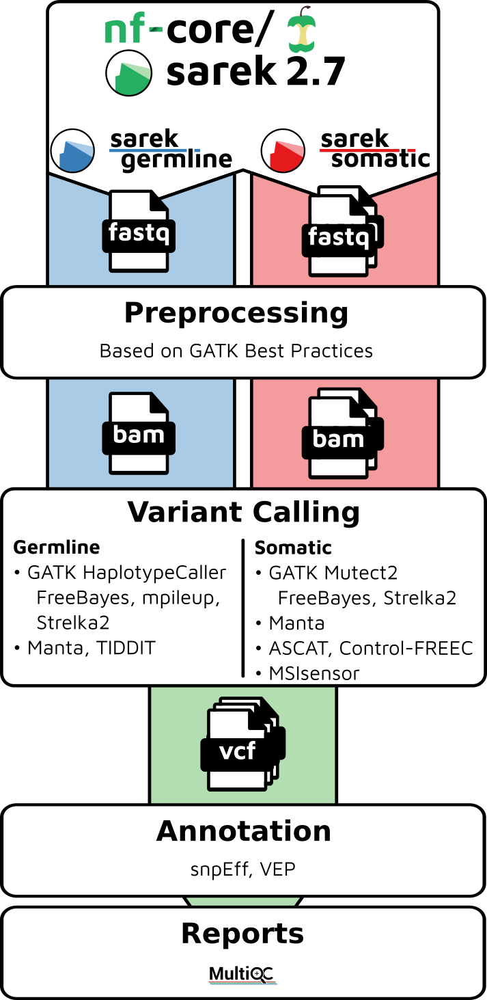
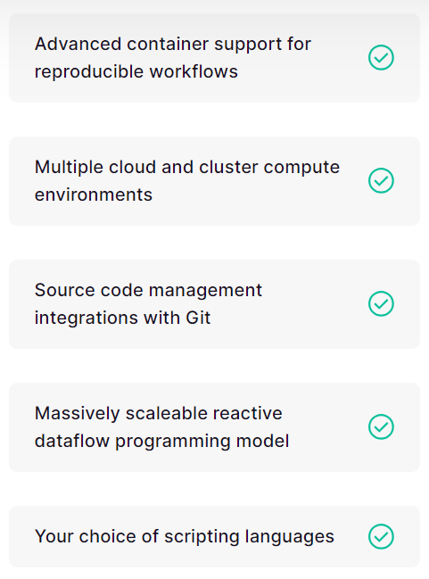

exclude: true
count: false

```{r,echo=FALSE,child="assets/header-slide.Rmd"}
```

<!-- ------------ Only edit title, subtitle & author above this ------------ -->

```{r,echo=FALSE,message=FALSE,warning=FALSE}
knitr::opts_chunk$set(echo = FALSE, fig.align = "center")
```

---

.pull-left-50[

# Workflow

* Analysing data involves a sequence of tasks, including gathering, cleaning, and processing data.

* These sequence of tasks are called a workflow or a pipeline.

* These workflows typically require executing multiple software packages, sometimes running on different computing environments, such as a desktop or a compute cluster.

* Traditionally these workflows have been joined together in scripts using general purpose programming languages such as Bash or Python.

* However, as workflows become larger and more complex, the management of the programming logic and software becomes difficult.

]

.pull-right-50[

```{r, out.width = "50%", fig.height = 200, fig.cap = "Example bioinformatics variant calling workflow/pipeline diagram from nf-core."}

```

]
  
---

# Workflow Management Systems

 * Workflow Management Systems (WfMS), such as Snakemake, Galaxy, and Nextflow have been developed specifically to manage computational data-analysis workflows in fields such as Bioinformatics, Imaging, Physics, and Chemistry.

 * WfMS contain multiple features that simplify the development, monitoring, execution and sharing of pipelines.
 
 * Key features include;

    * Run time management
    
    * Software management
    
    * Portability & Interoperability
    
    * Reproducibility
    
    * Resumability

---

# Nextflow

<br>

```{r out.width = "50%"}
knitr::include_graphics("data/nextflow-logo.png")  
```
  
<br>
<br>
  
 * Nextflow is a workflow orchestration engine and domain-specific language (DSL) that makes it easy to write data-intensive computational workflows.

 * It is designed around the idea that the Linux platform is the lingua franca of data science. Linux provides many simple but powerful command-line and scripting tools that, when chained together, facilitate complex data manipulations.

 * Nextflow extends this approach, adding the ability to define complex program interactions and a high-level parallel computational environment, based on the dataflow programming model.
 
 * Nextflow scripting is an extension of the Groovy programming language which, in turn, is a super-set of the Java programming language.
 
???
presenter notes!

---

# Nextflow Features

.pull-left-50[

* Nextflow’s core features are:

  * Workflow portability so that it can be executed on multiple platforms
  
  * Reproducibility of configurations and versions
  
  * Scalability of parallelization and deployment

  * Integration of existing tools, systems, and industry standards
  
  * Continuous checkpoints during pipleine execution to track intermediate outputs
  
]

.pull-right-50[

```{r, out.width = "65%", fig.cap = "Some additional features of Nextflow."}

```
]

---

# Setup

 * Nextflow can be used on any POSIX-compatible system (Linux, macOS, Windows Subsystem for Linux, etc.).
 
 * Requirements

    * Bash
    
    * Java 11 (or later, up to 18)
    
    * Git
    
    * Docker
    
 * Docker

    * Ensure you have Docker running on your server.
    
---

#Installation
    
Enter this command in your terminal to download nextflow:

```{verbatim, echo = TRUE, lang = "bash"}
wget -qO- https://get.nextflow.io | bash
```
Or, if you prefer curl:

```{verbatim, echo = TRUE, lang = "bash"}
curl -s https://get.nextflow.io | bash
```

Then ensure that the downloaded binary is executable:

```{verbatim, echo = TRUE, lang = "r"}
chmod +x nextflow
```

And put the nextflow executable into your ``$PATH``. The executable could be in ``/usr/local/bin``, ``/bin/``, etc.

To test that the environment is working correctly, type the following into the terminal:

```{verbatim, echo = TRUE, lang = "r"}
nextflow info
```

This should come up with the Nextflow version and runtime information:

```{verbatim, echo = TRUE, lang = "r"}
Version: 22.10.4 build 5836
Created: 09-12-2022 09:58 UTC
System: Linux 5.15.0-47-generic
Runtime: Groovy 3.0.13 on OpenJDK 64-Bit Server VM 17.0.3-internal+0-adhoc..src
Encoding: UTF-8 (UTF-8)
```


<!-- --------------------- Do not edit this and below --------------------- -->

---
name: end_slide
class: end-slide, middle
count: false

# Thank you. Questions?

```{r,echo=FALSE,child="assets/footer-slide.Rmd"}
```

```{r,include=FALSE,eval=FALSE}
# manually run this to render this document to HTML
rmarkdown::render("slide_nextflowbasics.Rmd", "xaringan::moon_reader")
# manually run this to convert HTML to PDF
#pagedown::chrome_print("slide_nextflowbasics.html",output="slide_nextflowbasics.pdf")
```